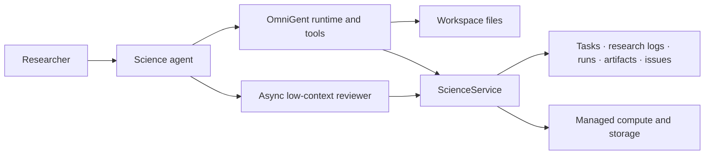

<div align="center">

# OmniSci

### A local-first scientific workbench built on the OmniGent meta-agent harness.

</div>

OmniSci combines OmniGent's cross-harness agent runtime with a
Claude Science-style research workflow. You can use Claude Code, Codex, Cursor,
OpenCode, or another supported agent while keeping the surrounding scientific
work—tasks, research logs, compute runs, artifacts, approvals, and reviewer
issues—in one auditable workspace.

The important distinction is:

- **OmniGent runs the agents.** It owns conversations, harnesses, models,
  subagents, tools, policies, approvals, sandboxes, and streaming.
- **OmniSci records the science.** It adds folder-scoped research state,
  durable compute and artifact provenance, scientific viewers, and a quiet
  background reviewer.

OmniSci does not introduce a new agent loop or route ordinary tool calls through
a separate science runtime. The Science agent uses normal OmniGent tools and can
dispatch a low-context reviewer asynchronously. That reviewer raises
evidence-backed issues in a checklist without blocking the main conversation.

## Workspace model

A project is simply a folder. Opening a folder is enough; there is no project
ID or required project YAML file.

OmniSci keeps implementation state in `.omnisci/` inside the folder, much like
Git uses `.git/`. Researchers work with their normal files:

```text
my-research/
├── data/
├── analyses/
├── notebooks/
├── figures/
├── reports/
├── results/
└── .omnisci/       # SQLite state, run logs, and exports
```

The durable scientific records are:

- **Tasks** — bounded planned work.
- **Research logs** — what happened, what was learned, and the relevant
  assumptions, limitations, sources, runs, and artifacts.
- **Runs** — supervised local or remote scientific jobs.
- **Artifacts** — checksummed outputs with provenance.
- **Reviews and issues** — asynchronous criticism and its resolution history.
- **Approvals** — explicit human or policy authorization for sensitive actions.

## Development

Requires Python 3.12+, Node.js 22+, and [`uv`](https://docs.astral.sh/uv/).

```bash
uv sync
uv run pytest science/tests
uv run pytest tests/science_server

cd web
npm install
npm test
```

Start the application using the normal OmniGent development commands:

```bash
make dev
```

The `science` CLI exposes the durable research records and managed job/storage
operations:

```bash
science project status --json
science tasks list --json
science research-log list --json
science issues list --status open --json
science jobs status <run_id> --json
```

## Architecture



`ScienceService` is a deterministic application layer over the science database
and provider adapters. It records and validates scientific state; it is not an
agent runtime or general-purpose tool broker.

See [the concise product requirements](docs/OMNISCI_PRD.md) for the intended
behavior and [the fork delta](FORK_DELTA.md) for changes relative to
[OmniGent](https://github.com/omnigent-ai/omnigent).

## Status

OmniSci is an early research prototype. The local workflow, science API,
compute/storage providers, artifact viewers, and Science agent bundle are under
active development. Do not treat reviewer findings as authoritative or use the
system as a substitute for domain, safety, clinical, or regulatory review.

## License

Apache-2.0. OmniSci preserves OmniGent's license and attribution.
# OmniSci
